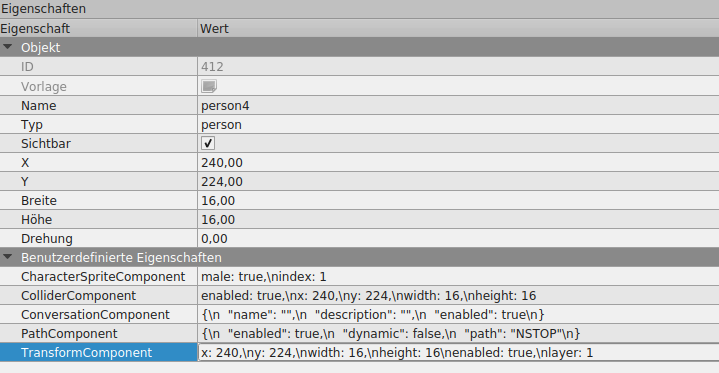

# TiledMapStructure

FWM-Engine uses *.tmx files, which can be edited with the free software
Tiled (www.tiled.org Version 1.1*).

################################################################################
## MAP Properties

 * musicType: (town|battle)
 * musicIndex: number of the music to use
 * weather: (clouds)*

################################################################################
## Layers

Every Map consists of several layers. Some are optional, some must be available.
All layers should be sorted in the correct rendering order.

### Graphical Layers

Names and order of graphical layers is more or less free. The order is important
for the rendering process. The optimal naming scheme is:

 * ...
 * walls(n+1)
 * ground(n+1)
 * ...
 * tops1
 * lights1
 * shadows1
 * objects1
 * walls1
 * ground1

Layer names follow the scheme [layer name][layer number]

### Object Layers

Object layers comntain rectangles with information about the game objects in
that layer.

#### Neccessary Layers

 * people .. the layer, where people are drawn
 * sensors .. contains trigger objects
 * colliderWalls[number] .. colliders for game physics
 * objects .. non-living objects like signs and so on

#### Optional Layers

 * animatedObjects[number] .. objects that get animated

################################################################################
## Objects

The Guardian Monsters engine is switching to it's own entity-component-system,
based on LimbusBehaviour and LimbusGameObject. A LimbusGameObject is any object
defined in Tiled. And a LimbusBehaviour is a child of it, defined in Tiled in
the properties.

The property name always defines the class to use. The value is the components
values as Json, without the outermost waved brackets. We can use libGDX's simple
Json notation here. For example:

TransformComponent | enabled:true, x:240, y:100, width:16, height:16, layer:1

A tiled object implicitly has a TransformComponent. For now make sure to enter
the same values for the object and TransformComponent.

New components always must inherit from LimbusBehaviour and override the
abstract val property "defaultJson". Have a look into ColliderProperty, to see
how it's done.

### Custom Components

If using components from the Engine, like TransformComponent, ColliderComponent
and so on, the simple class name is enough in Tiled. For your own components
however you must enter the full right now. This might become better in a later
version.

To create custom components, you have to extend `LimbusBehaviour` and implement
`IComponentParser`. Have a look into `ConversationComponentParser` to see how
to implement such a parser.

### objects
#### sign
Sign objects are for things which need a description

 * title: title of the description
 * text: text of the description

### animatedObjects
Contains place holders for animations
 * index: name of the animation to use
 * frameDuration: duration of an animation frame

### sensors
Sensors are objects which trigger an action

#### warpField
 * targetID: number of the target map
 * targetWarpPointID: number of the startField object, where the player should start

#### startField
 * fieldID: ID of this object, must be unique in the whole map

### livingEntities
#### person

 * male: which sprite type (true|false)
 * static: whether a person walks around (true|false)
 * spriteIndex: which sprite (number)
 * name: name of the person
 * text: spoken text of a person
 * path: defines a walking path or looking direction (NSTOP|ESTOP|SSTOP|WSTOP|N|E|S|W)*

