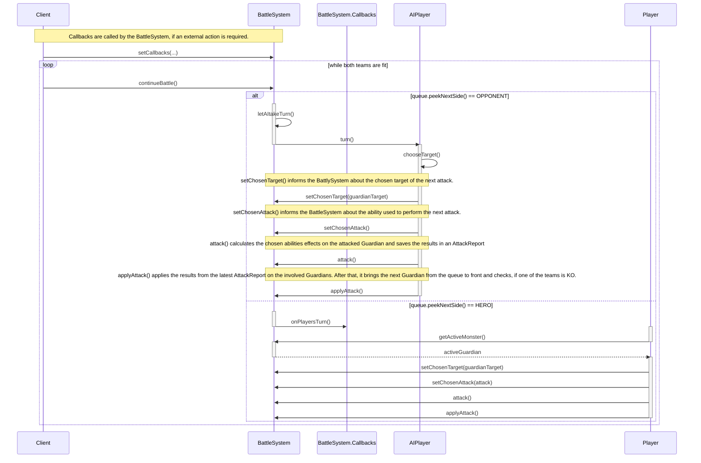

# Battle System

The **Battle System** ist initialized with two instances of `Team`. After or at initialization a `BattleSystem.Callbacks`-object must be provided:

```java
BattleSystem battle = new BattleSystem(teamHero, teamOpponent, null);

BattleSystem.Callbacks battleCB = new BattleSystem.Callbacks(){...};
```

## Sequence Diagram


