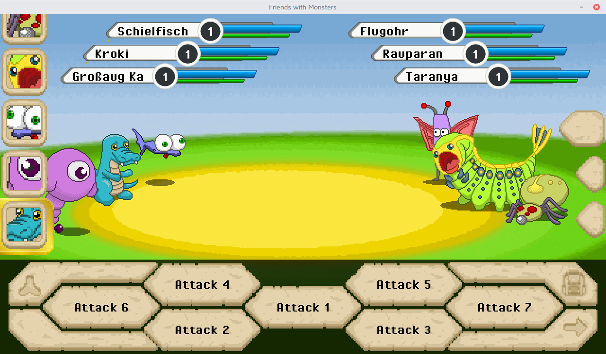

# Welcome

# Credits
Credits can be seen [here](./Documents/CREDITS.md).

# Tools
FirendsWithMonsters is created with Android Studio, Inkscape, GIMP and
mtPaint and powered by Java and libGDX.

# Screenshots
Here you can get a first glimpse of what will be created here.
For more screenshots see the [Galery](https://bitbucket.org/gemlion/monsterworld/wiki/Galery).



# Downloads
here you can Download the [Test-Build for Desktop](./Builds/Testing/Desktop/FriendsWithMonsters-ALPHA-0.0.3.0.jar)
and the [Test-Build for Android](./Builds/Testing/Android/FriendsWithMonsters-ALPHA-0.0.3.0.apk).
All you need is Java 8. Launch it with

```
java -jar FriendsWithMonsters-VERSION.jar
```
