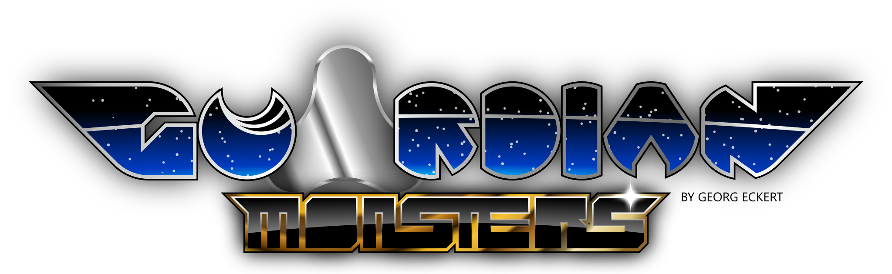

# Welcome

> Help Wanted: I cannot finish this on my own. If you are willing to help, let me know.

GuardianMonsters is a Free and Open Source monster taming RPG inspired by Pokémon, Final Fantasy and Golden Sun.

GuardianMonsters is proudfully made with

+ libGDX
+ Gimp
+ Inkscape
+ AndroidStudio
+ Kotlin and Java
+ several libGDX supporting libraries
+ Tiled

For detailled information see [Third Party Notes](./third-party-notes/THIRD-PARTY-NOTES.md).

# Features

+ Maps built with Tiled
  - system for adding objects and components via map objects
  - several walkable layers
+ walking in 4 directions (just like in Pokemon GameBoy games)
+ taming Monsters
+ inventory (health items, equippable weaponry and clothes)
+ ability system (unlock abilities on an ability board with every new level)
+ weather and times of day on the map (weather effects and differently colored tile sets)
+ animations in battle and on the map
+ battle system with animations and AI
+ elemental system with 12 elements
+ abilities
  - healing
  - physical attacks
  - magical attacks
+ up to 3 on 3 battles

# Videos

See more trailers under [Documents/Videos](./Documents/Videos)

Video of the new inventory system with equipping monsters with items and learning new abilities:

Video of one of the first playable versions of GuardianMonsters:

# Screenshots

See more screenshots under [Documents/Screenshots](./Documents/Screenshots)

# License

GuardianMonsters' code is licensed under Apache-2.0. All artwork is licensed under CC-BY-3.0. Any third party components and artwork are listed in the directory `third-party-notes`.

# Credits

Proudly made with

